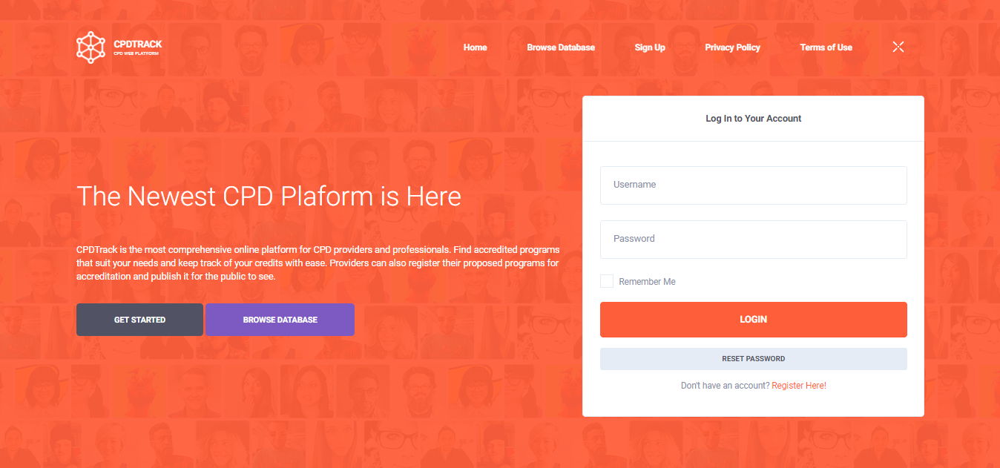

# What is CPDTrack?

## Overview

**CPDTrack** is the most comprehensive online platform for CPD providers and professionals. Find accredited programs that suit your needs and keep track of your credits with ease. Providers can also register their proposed programs for accreditation and publish it for the public to see.

## About

This project in a part of the developer's undergraduate thesis. This aims to serve as an alternate online platform for all processes concerning continuing professional development. This version is currently tailored for the Philippine Regulation Commission Board for Librarians.

## Author

**Gerard Balaoro** is an undergraduate student at the University of the Philippines Diliman taking a Bachelor's Degree in Library and Information Science. He specializes on Information Technology and Digital Preservation.

> More info: [https://www.linkedin.com/in/gerardbalaoro](https://www.linkedin.com/in/gerardbalaoro)

## License

This work is licensed under a [**Creative Commons Attribution-NonCommercial-ShareAlike 4.0 International License**](http://creativecommons.org/licenses/by-nc-sa/4.0/).


This is a human-readable summary of \(and not a substitute for\) the license.


### You are free to:

* **Share** - copy and redistribute the material in any medium or format
* **Adapt** - remix, transform, and build upon the material

The licensor cannot revoke these freedoms as long as you follow the license terms.

### Under the following terms

* **Attribution** — You must give appropriate credit, provide a link to the license, and indicate if changes were made. You may do so in any reasonable manner, but not in any way that suggests the licensor endorses you or your use.
* **NonCommercial** — You may not use the material for commercial purposes.
* **ShareAlike** — If you remix, transform, or build upon the material, you must distribute your contributions under the same license as the original.
* **No additional restrictions** — You may not apply legal terms or technological measures that legally restrict others from doing anything the license permits.

### Notices

* You do not have to comply with the license for elements of the material in the public domain or where your use is permitted by an applicable exception or limitation.
* No warranties are given. The license may not give you all of the permissions necessary for your intended use. For example, other rights such as publicity, privacy, or moral rights may limit how you use the material.


For a complete copy of the license, see [h](http://creativecommons.org/licenses/by-nc-sa/4.0/)[ttp://creativecommons.org/licenses/by-nc-sa/4.0/](https://creativecommons.org/licenses/by-nc-sa/4.0/legalcode).


