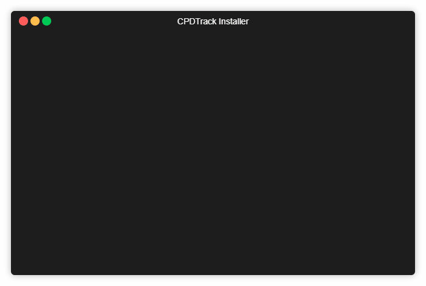

# Installation

## Command Line Installer

Once the environment configurations are set, fire up the command terminal at the root of the application folder and run the command.

```bash
php artisan app:install [options]
```



<table>
  <thead>
    <tr>
      <th style="text-align:left">Options</th>
      <th style="text-align:left">Description</th>
    </tr>
  </thead>
  <tbody>
    <tr>
      <td style="text-align:left"><code>-d</code>, <code>--dummy</code>
      </td>
      <td style="text-align:left">Generate dummy data</td>
    </tr>
    <tr>
      <td style="text-align:left"><code>-c</code>, <code>--clean</code>
      </td>
      <td style="text-align:left">Generate dummy data <em>(will destroy all exisiting data)</em>
      </td>
    </tr>
    <tr>
      <td style="text-align:left"><code>-r</code>, <code>--refresh</code>
      </td>
      <td style="text-align:left">Refresh migrations <em>(will destroy all exisiting data)</em>
      </td>
    </tr>
    <tr>
      <td style="text-align:left"><code>-u</code>, <code>--username</code>
      </td>
      <td style="text-align:left">
        <p>Default Administrator Account Username.</p>
        <p></p>
        <p><code>php artisan app:install --username=superadmin</code>
        </p>
      </td>
    </tr>
    <tr>
      <td style="text-align:left"><code>-p</code>, <code>--password</code>
      </td>
      <td style="text-align:left">
        <p>Default Administrator Account Password.</p>
        <p></p>
        <p><code>php artisan app:install --password=PASSW0RD!!</code>
        </p>
      </td>
    </tr>
    <tr>
      <td style="text-align:left"><code>-n</code>, <code>--no-interaction</code>
      </td>
      <td style="text-align:left">Disable all user prompts, automate all actions.</td>
    </tr>
  </tbody>
</table>This will run all the necessary scripts to setup the application. Upon completion, it will create an administrator account and provide a set of credentials.


It is important to modify the default credentials created by the installation script.


## Upgrading

When upgrading to a later version, simply overwrite the application files and run the command below.

```bash
php artisan app:update
```

