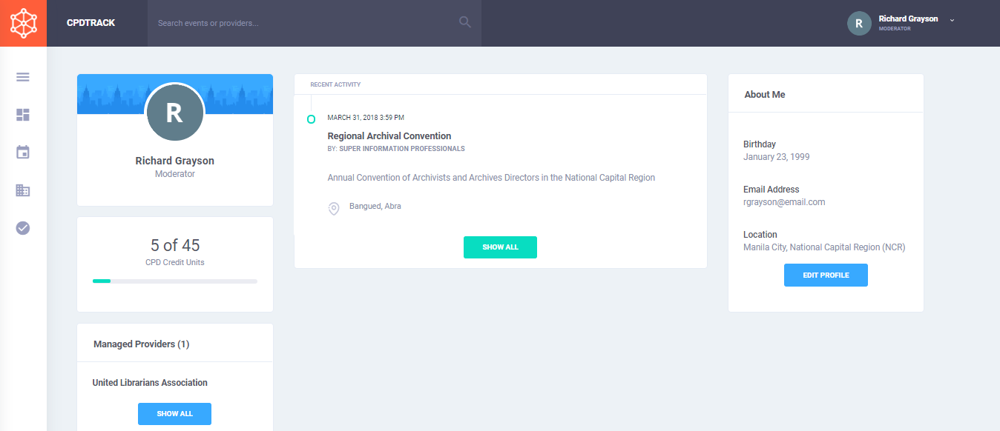

# Dashboard

The dashboard serves as the home page for all authenticated users. The left column contains cards that display the user's name and role as well as the total credits they acquired for the duration their license is valid. The bottom-left card displays a short list of the providers managed by the user.

The middle column presents the last programs \(accredited and self-directed\) attended by the user. The right columns displays a short overview of the user's information.


A user's dashboard is visible to only the [administrator ](../advanced/user-management.md#user-roles)and himself.


## Recording My Programs

