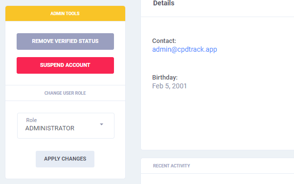

# User Management

## User Roles

The application uses [**Role-Based Access Control \(RBAC\)**](https://en.wikipedia.org/wiki/Role-based_access_control), a system of controlling which **users have access to resources based on the role of the user**. Access rights are grouped by role name, and access to resources is restricted to users who have been authorized to assume the associated role [_\(Webopedia\)_](https://www.webopedia.com/TERM/R/RBAC.html).

<table>
  <thead>
    <tr>
      <th style="text-align:left">Privileges</th>
      <th style="text-align:left">Member</th>
      <th style="text-align:left">Moderator</th>
      <th style="text-align:left">Administrator</th>
    </tr>
  </thead>
  <tbody>
    <tr>
      <td style="text-align:left">
        <ul>
          <li>Track CPD Credits</li>
          <li>Register Providers</li>
          <li>Create Programs</li>
          <li>Find Programs</li>
        </ul>
      </td>
      <td style="text-align:left">
        
      </td>
      <td style="text-align:left">
        
      </td>
      <td style="text-align:left">
        
      </td>
    </tr>
    <tr>
      <td style="text-align:left">
        <ul>
          <li>Handle Program Accreditation</li>
          <li>Verify Provider Pages</li>
        </ul>
      </td>
      <td style="text-align:left">
        
      </td>
      <td style="text-align:left">
        
      </td>
      <td style="text-align:left">
        
      </td>
    </tr>
    <tr>
      <td style="text-align:left">
        <ul>
          <li>Configure Application</li>
          <li>Create / Suspend / Verify User Accounts</li>
        </ul>
      </td>
      <td style="text-align:left">
        
      </td>
      <td style="text-align:left">
        
      </td>
      <td style="text-align:left">
        
      </td>
    </tr>
  </tbody>
</table>

## Managing User Accounts

Administrators are given the highest privileges and can access all of the configurations within the system. As such, they have **special permissions** \(verify information, suspend, and assign roles\) to all existing accounts and create new ones.

## Verification

The **verfied badge**  lets users know that an account authentic.

