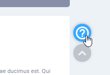

# Dashboard

The dashboard serves as the home page for all authenticated users. The left column contains cards that display the user's name and role as well as the total credits they acquired for the **duration their license is valid**. The bottom-left card displays a short list of the providers managed by the user.


License duration is calculated using the user's registration date \(from their professional ID\) and their date of birth.


The middle column presents the last programs \(accredited and self-directed\) attended by the user. The right columns displays a short overview of the user's information.

## Floating Buttons

There are two floating buttons available to users, first would be the **back to top** button, which allows users to scroll upwards in a single click.

The other is the **help** button. When clicked, this will activate the tour sequence which gives the users a look around of the elements on the page and how they work. If a tour is not available, it would redirect the user to the guide page.

