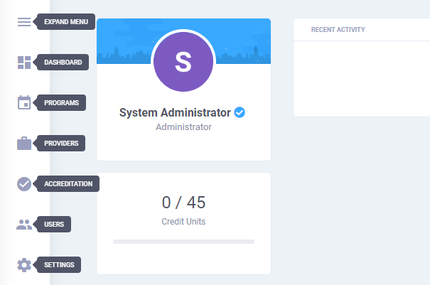
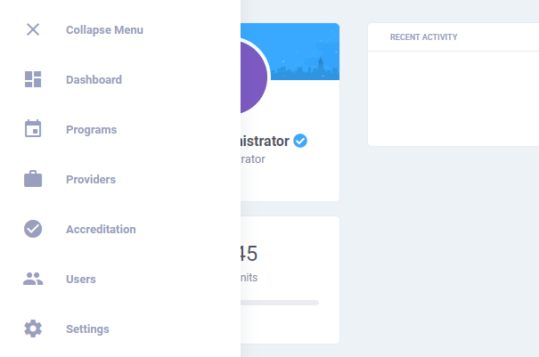

# Navigation

The application's primary modules can be accessed using the sidebar menu, which appears in two states \(compact and expanded\).

Do note that **not all modules will be accessible to all users**, some are limited only to users with [special privileges](../administration/user-management.md#user-roles). For instance the accreditation module are only accessible to moderators.

