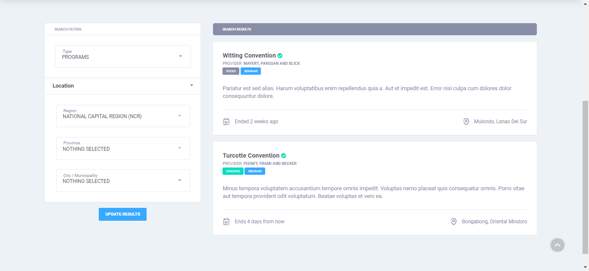

# Search Module

The search module is one of the key features of the system. It supports location filters and browses both programs and providers databases.

An **open search** module is also accessible publicly, provided that the administrator enabled this in the [application settings](../administration/configuration.md#application-settings).

