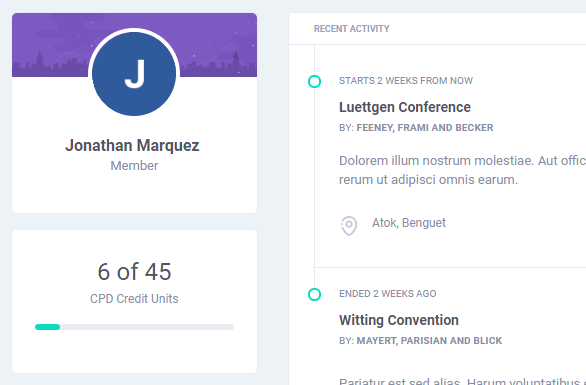

# Tracking Credits

One of the most highlighted feature of the application is its credits tracking ability. It helps users keep track of how much credits or points they earned from participating in programs for the duration of their license. The overall points acquired is displayed at the dashboard.


**CPD Credits Units or CPD Points** refers to the numerical value equivalent to the amount of learning obtained by participating in accredited programs.


## Adding My Programs

The process is pretty straight-forward, search for any program, open its page, and click the **Add to My Activity** button. It will prompt you to specify how much credits did you earn for the program.


The system **does not** have any means to verify if users acutally participated in that program nor find out if they did earn the credits they specified. Thus, the credits entered in the application is not automatically honored by the official institution.


### Changing Credits Earned

When a program has been successfully added to a user's record, that user will have the option to change how much credits they earned.

## Removing From My Activity

Users also have the ability to remove a program from their activity list, this can be done by clicking the **Remove From My Activity** button.

