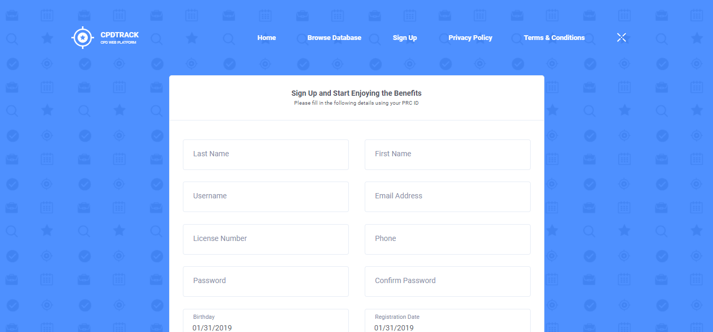
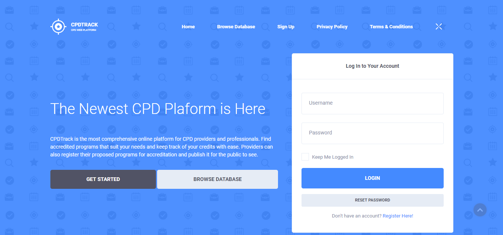

# Getting Started

## Registration

Signing up allows users to keep a database of all the programs they participated in and how much credits they earned.

For best experience, users are recommended to provide the necessary information as it appears on their professional identification card. This information will not be visible to other users and the public.

After registration, the users will receive an email containing their credentials.

## Logging In

Users must login user a username-password combination to access the primary features of the application.

## Resetting Password

Forgot your password? Click the **Reset Password** button and enter your username. The application will send a reset link to your email address.

