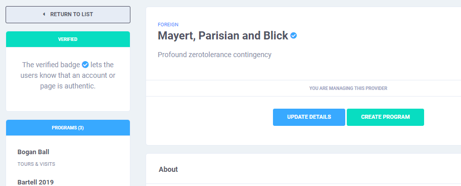

# Providers


**CPD Providers**, or simply, **Providers** are individuals or organizations that are accredited by a governing organization. They can conduct programs and activities that reward CPD Credit Units.


All registered users may register and create their own provider pages. The system does not verify the information during this process and it is up to the discretion on the account holders whether or not they use authentic infomation.

## Verification

The **verfied badge**  lets users know that an account or page is authentic. This also grants additional features to page administrators, such as the ability to customize their provider's handle.

To get verified, administrators of the page must contact any system modernator or administrator and present proof \(valid ID or certification\) that their account or page is authentic.

## Managing Administrators  

Existing provider administrators can grant administrative access to other users by entering their username. Revoking admin access from an account can be done by clicking the **x** mark beside their names.

